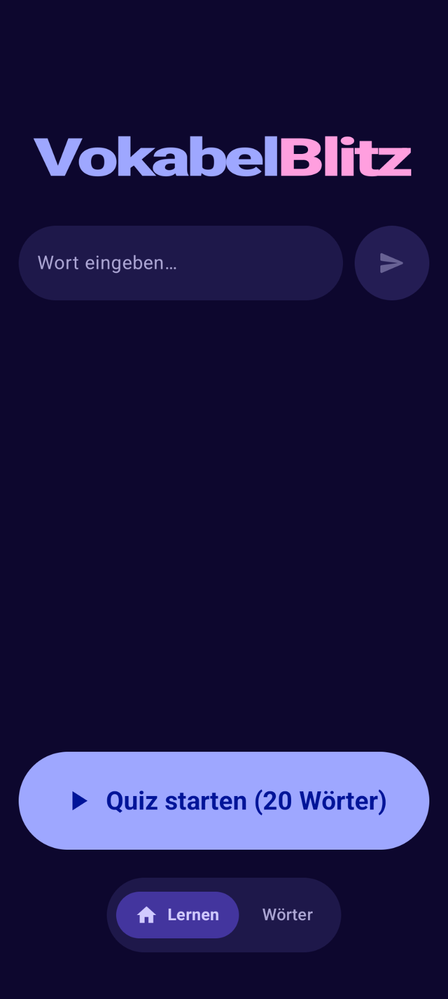
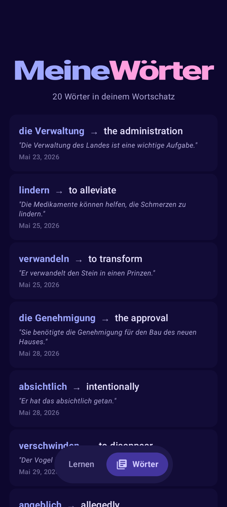
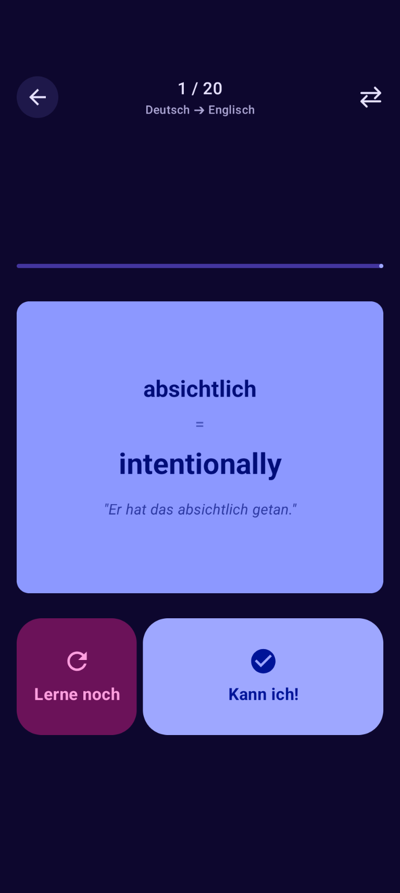

# VokabelBlitz ⚡

A modern, on-device AI-powered vocabulary learning app for Android. VokabelBlitz helps you build and reinforce your German-to-English vocabulary using intelligent, local translation, grammar formatting, and interactive flashcard quizzes.

---

## 📱 Screenshots

<p align="center">
  
  
  
</p>

---

## ✨ Features

- **On-Device AI Translation**: Enter any German word or phrase, and the app leverages **Gemini Nano** (via Google ML Kit GenAI) to translate it, format it grammatically, and generate a natural usage example sentence—completely offline.
- **Intelligent Grammar Rules**:
  - **Nouns** are automatically capitalized and prepended with their correct grammatical gender article (`der`, `die`, `das`).
  - **Verbs** are formatted in lowercase infinitive, and their English translations are prepended with `to`.
  - **Adjectives/Adverbs** are kept in their basic lowercase form.
- **Dynamic Flashcard Quizzes**: Study vocabulary with responsive, interactive 3D-flipping flashcards. Tap to reveal, and use the split action button to mark cards as **Kann ich!** (Known) or **Lerne noch** (Still learning).
- **Reversible Study Directions**: Instantly swap quiz directions between *German ➔ English* and *English ➔ German* at any point.
- **Quick Entry Widget**: Add a Material You (Monet) themed widget to your home screen. Tap the input area to launch a transparent quick-add dialog, or start a new quiz instantly.
- **Swipe-to-Dismiss Word Library**: Swipe left or right on any word in your dictionary to delete it, featuring fluid animations and instant undo snackbars.

---

## ⚙️ Device & System Requirements

- **Operating System**: Android 12 (API level 31) or higher.
- **Target SDK**: Android 15/16 (API level 37).
- **On-Device AI Requirements**: To utilize local translation features, you need an Android device that supports **Gemini Nano** via the Google Play Services AI Core (e.g., Google Pixel 8 Pro, Google Pixel 9 series, Samsung Galaxy S24/S25 series, or newer compatible devices).

---

## 📦 Installation & Build

### Option 1: Direct APK Installation (Recommended)
You can download the pre-compiled release APK directly from the **[Releases](https://github.com/tui2019/VokabelBlitz/releases)** section on GitHub:
1. Download `VokabelBlitz_v1.1_Release.apk` onto your compatible Android device.
2. Open the downloaded file and allow your browser or file manager to "Install unknown apps" if prompted.
3. Launch **VokabelBlitz** from your app drawer.

### Option 2: Build from Source
If you want to build and compile the app yourself:
1. Clone this repository.
2. Open the project in Android Studio (Jellyfish or newer recommended).
3. Connect a compatible Android device with USB Debugging enabled.
4. Compile and install the debug build:
   ```bash
   ./gradlew installDebug
   ```
